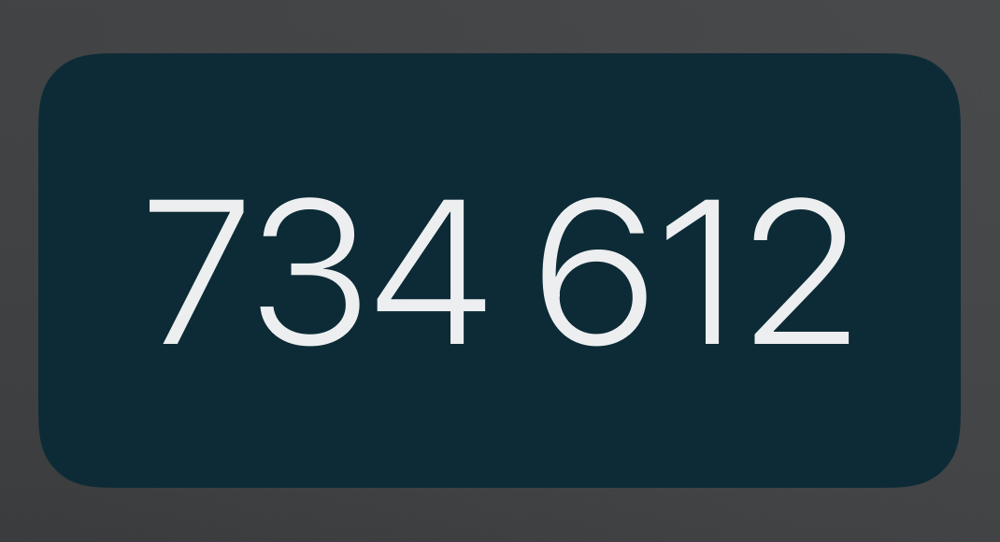
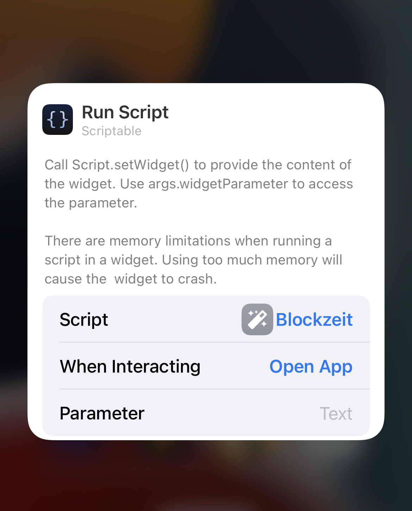

# Blocktime

The 'Blocktime Widget' shows the current blocktime aka blockheight.

In Line 17, 20, 23 of the script a thousands delimiter can be choosen.




## Tutorial

1. Install the app "Scriptable" -> [Apple Appstore - Scriptable](https://apps.apple.com/ch/app/scriptable/id1405459188?l=en)
1. Open the app and click the "+" sign on the top right corner
1. Paste the following script created by [Janna](https://twitter.com/Janna3257):

```js
//
// 2022-04 Twitter:@janna3257 Github:@ux3257
//


// get current blockheight from mempool.space
let req = new Request('https://mempool.space/api/blocks/tip/height');
let blockHeight = await req.loadString();


// Insert thousands delimiter -> easier to read.
// Select a delimiter: V1(default), V2 or V3.
// If delimiter is not desired put "//" bevor line 26 & 27
let position = blockHeight.length-3;

// V1: set " " as delimiter
let delimiter = " ";

// V2: set "." as delimiter
//let delimiter = ".";  

// V3: set "," as delimiter
//let delimiter = ",";

// If thousands delimiter is not desired put "//" bevor ne next two lines
blockHeight = [blockHeight.slice(0, position), delimiter, blockHeight.slice(position)].join('');
let widget = await createWidget();


// Check where the script is running
if (config.runsInWidget)
  {
  // Runs inside a widget, so add it to the homescreen widget
  Script.setWidget(widget);
  }
else
  {
  // Show the medium widget inside the app
  widget.presentMedium();
  }

Script.complete();


async function createWidget()
  {
  // Create new empty ListWidget instance
  let listwidget = new ListWidget();

  // Set background color
  listwidget.backgroundColor = new Color("#002b38");

  // Add widget heading
  let heading = listwidget.addText(blockHeight);
  heading.centerAlignText();
  heading.font = Font.lightSystemFont(73);
  //set text color
  heading.textColor = new Color("#eeeeee")

  // Return the created widget
  return listwidget;
}
```

4. Click on the bottom left corner the "sliders" to name your script. For example: Blocktime
5. Click close and done
6. Go to the homescreen, press and hold for a few seconds to make the icons move. Tab on the top left corner the "+" symbol


7. Scroll down untill you find the "Scriptable" App. Select it and scroll to the right for the full sized version.


8. Click "Add Widget" and tab the new created widget to edit it. Select the created script and you're done :)


