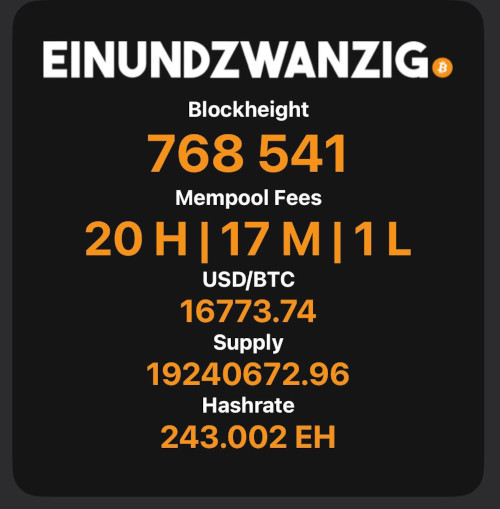
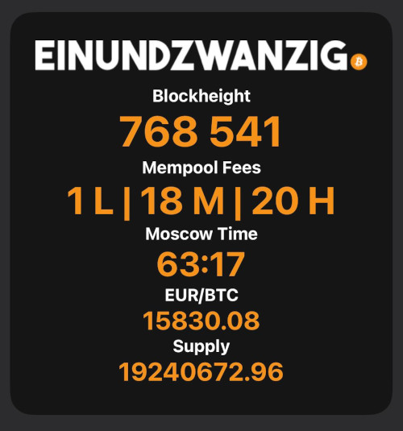
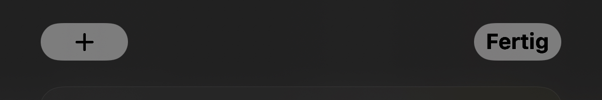
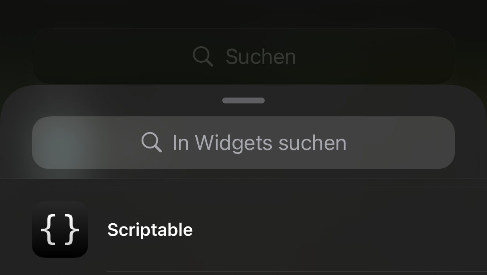
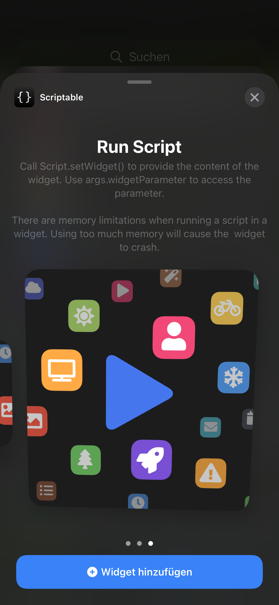
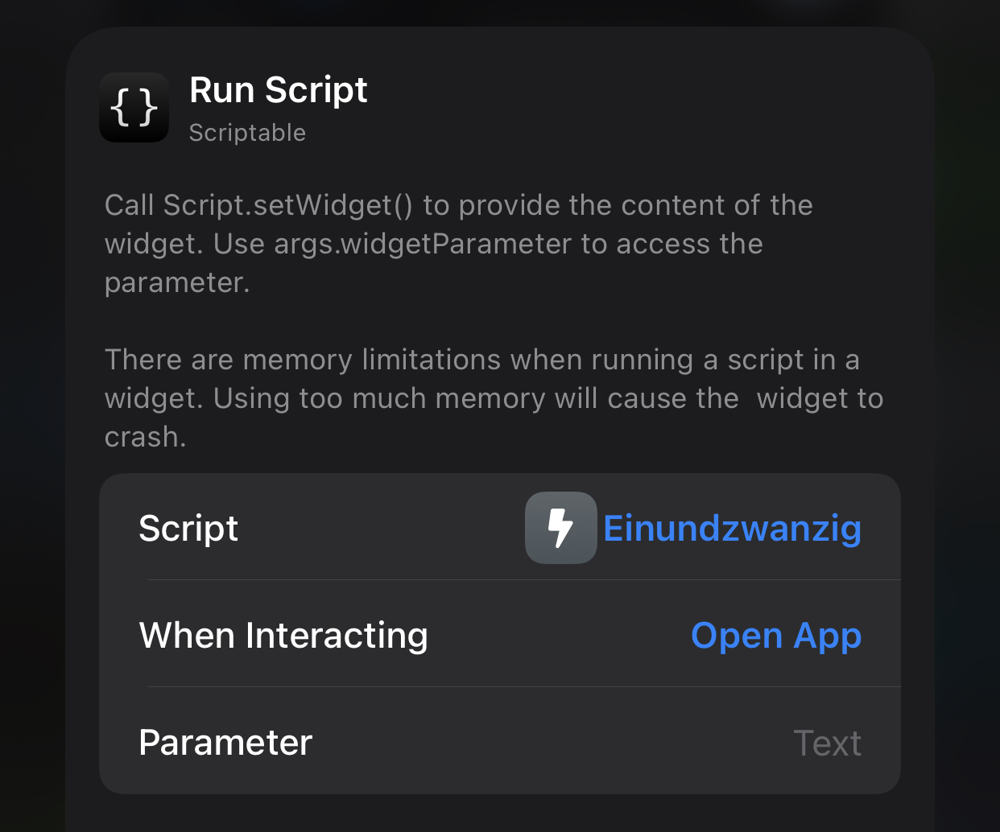

# Einundzwanzig Widget
Value4Value: FlashmanBTC@ln.tips or via LNTXBOT FlashmanBTC



V2 Blockheight 768541
1. Install the app "Scriptable" -> [Apple Appstore - Scriptable](https://apps.apple.com/ch/app/scriptable/id1405459188?l=en)
2. Open the app and click the "+" sign on the top right corner
3. Paste the following script created by [FlashmanBTC](https://twitter.com/FlashmanBTC):
4. You can edit scale if you have a smaller device. Tested it with iPhone 11 Pro and iPhone SE 2020

```js

// Variables used by Scriptable.
// These must be at the very top of the file. Do not edit.
// icon-color: deep-gray; icon-glyph: bolt;
// Einundzwanzig Edition by FlashmanBTC

// Font scaling for smaller displays
// Scale  0 = iPhone 11 Pro
// Scale -4 = iPhone SE 2020
scale = 0

// Change currency EUR or USD
currency = "EUR"

// Change fee order
// 1 = high to low
h_to_l = 0

// Show infos
// Attention max 5!, 1 = on
show_block  = 1
show_fees   = 1
show_moscow = 1
show_price  = 1
show_supply = 1
show_hash   = 0

// Request data
let req_logo = new Request('https://i.ibb.co/MSSJYtq/Einundzwanzig-logo.png');
let Einundzwanzig = await req_logo.loadImage();

let req_height = new Request('https://mempool.space/api/blocks/tip/height');
let blockHeight = await req_height.loadString();
let position_block = blockHeight.length-3;
let delimiter_block = " ";
blockHeight = [blockHeight.slice(0, position_block), delimiter_block, blockHeight.slice(position_block)].join('');

let req_fees = new Request('https://mempool.space/api/v1/fees/recommended');
let Fees = await req_fees.loadJSON();
fast = Fees.fastestFee.toString();
halfHour = Fees.halfHourFee.toString();
hour = Fees.hourFee.toString();


// let req_moscow = new Request('https://bitcoinexplorer.org/api/price/usd/sats');
let req_moscow = new Request('https://blockchain.info/tobtc?currency='+currency+'&value=1');
let MoscowTimeFull = await req_moscow.loadString();
let MoscowTime = Number(MoscowTimeFull).toFixed(8);
MoscowTime = MoscowTime.substring(6);
let position_moscow = MoscowTime.length-2;
let delimiter_moscow = ":";
MoscowTime = [MoscowTime.slice(0, position_moscow), delimiter_moscow, MoscowTime.slice(position_moscow)].join('');
//MoscowTime = Number(MoscowTime).toFixed(8);
	
// let req_shitcoin = new Request('https://bitcoinexplorer.org/api/price/usd');
req_shitcoin = new Request('https://blockchain.info/ticker');
let Shitcoin = await req_shitcoin.loadJSON();
// let ShitcoinUSD = await req_shitcoin.loadString();
// let Supply = await req_supply.loadString();
if(currency == "EUR") {
  Shitcoin = Shitcoin.EUR.last.toString();
} else {
  Shitcoin = Shitcoin.USD.last.toString();
}
	
let req_supply = new Request('https://bitcoinexplorer.org/api/blockchain/coins');
let Supply = await req_supply.loadString();
Supply = Math.round(Supply * 100) / 100;
Supply = String(Supply);

req_hashrate= new Request('https://bitcoinexplorer.org/api/mining/hashrate');
let Hashrate = await req_hashrate.loadJSON();
Hashvalue = Hashrate['1Day'].val.toString();
HashrateAB = Hashrate['1Day'].unitAbbreviation.toString();

let widget = await createWidget();

// Check where the script is running
if (config.runsInWidget) {
  // Runs inside a widget so add it to the homescreen widget
  Script.setWidget(widget);
} else {
  // Show the medium widget inside the app
  widget.presentLarge();
}

Script.complete();

async function createWidget() {
  // Create new empty ListWidget instance
  let listwidget = new ListWidget();
  // Refresh widget  
  let nextRefresh = Date.now() + 1000*60 
  listwidget.refreshAfterDate = new Date(nextRefresh)

  // Set new background color
  listwidget.backgroundColor = new Color("#151515");

  // Einundzwanzig Logo
  let Einundzwanzig_Logo = listwidget.addImage(Einundzwanzig).centerAlignImage();
  let Spacer = listwidget.addSpacer(14)
  
  // Blockheight
  if(show_block == 1) {
    let blockTitel = listwidget.addText("Blockheight");
    blockTitel.centerAlignText();
    blockTitel.font = Font.boldSystemFont(16+scale);
    blockTitel.textColor = new Color("#FFFFFF");
    let block = listwidget.addText(blockHeight);
    block.centerAlignText();
    block.font = Font.boldSystemFont(40+scale);
    block.textColor = new Color("#F7931A");
  }

  // Mempool Fees
  if (show_fees == 1) {
    let feesTitel = listwidget.addText("Mempool Fees");
    feesTitel.centerAlignText();
    feesTitel.font = Font.boldSystemFont(16+scale);
    feesTitel.textColor = new Color("#FFFFFF");
	if(h_to_l == 1) {
      fees = listwidget.addText(fast + " H | " + halfHour + " M | " + hour + " L");
	} else {
	 fees = listwidget.addText(hour + " L | " + halfHour + " M | " + fast + " H");
	}
    fees.centerAlignText();
    if(fast < 10) {
      fees.font = Font.boldSystemFont(40+scale);
	} else if(fast < 100) {
       fees.font = Font.boldSystemFont(36+scale);
	} else {
      fees.font = Font.boldSystemFont(30+scale);
	}
    fees.textColor = new Color("#F7931A");
  }

  // Moscow Time
  if(show_moscow == 1) {
    let moscowTitel = listwidget.addText("Moscow Time");
    moscowTitel.centerAlignText();
    moscowTitel.font = Font.boldSystemFont(16+scale);
    moscowTitel.textColor = new Color("#FFFFFF");
    let moscowTime = listwidget.addText(MoscowTime);
    moscowTime.centerAlignText();
    moscowTime.font = Font.boldSystemFont(32+scale);
    moscowTime.textColor = new Color("#F7931A");
  }
 
  // Shitcoin/BTC
  if(show_price == 1) { 
    let shitcoinTitel = listwidget.addText(currency+"/BTC");
    shitcoinTitel.centerAlignText();
    shitcoinTitel.font = Font.boldSystemFont(16+scale);
    shitcoinTitel.textColor = new Color("#FFFFFF");
    let shitcoin = listwidget.addText(Shitcoin);
    shitcoin.centerAlignText();
    shitcoin.font = Font.boldSystemFont(24+scale);
    shitcoin.textColor = new Color("#F7931A");
  }

  // Bitcoin supply  
  if(show_supply == 1) {  
    let supplyTitel = listwidget.addText("Supply");
    supplyTitel.centerAlignText();
    supplyTitel.font = Font.boldSystemFont(16+scale);
    supplyTitel.textColor = new Color("#FFFFFF");
 	let supply = listwidget.addText(Supply);  
    supply.centerAlignText();  
    supply.font = Font.boldSystemFont(24+scale);  
    supply.textColor = new Color("#F7931A");
  }
	
  // Bitcoin hashrate 
  if(show_hash == 1) {  
    let hashTitel = listwidget.addText("Hashrate");
    hashTitel.centerAlignText();
    hashTitel.font = Font.boldSystemFont(16+scale);
    hashTitel.textColor = new Color("#FFFFFF");
 	let hash = listwidget.addText(Hashvalue+" "+HashrateAB);  
    hash.centerAlignText();  
    hash.font = Font.boldSystemFont(24+scale);  
    hash.textColor = new Color("#F7931A");
  }
  
  // Return the created widget
  return listwidget;
}
```

5. Click on the bottom left corner the "sliders" to name your script. For example: Einundzwanzig
6. Click close and done
7. Go to the homescreen, press and hold for a few seconds to make the icons move. Tab on the top left corner the "+" symbol



7. Scroll down untill you find the "Scriptable" App. Select it and scroll to the right for the full sized version.



8. Click "Add Widget" and tab the new created widget to edit it. Select the created script and you're done :D




