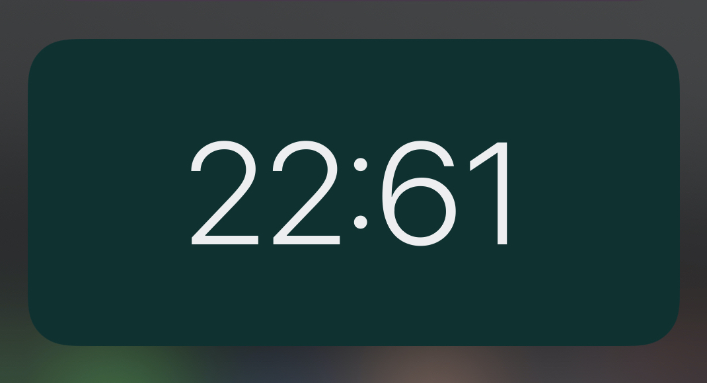

# Moscow Time Simple

The 'Moscow Time Simple Widget' shows the current number of Sats per Dollar in Moskow-Time format.



## Tutorial

1. Install the app "Scriptable" -> [Apple Appstore - Scriptable](https://apps.apple.com/ch/app/scriptable/id1405459188?l=en)
2. Open the app and click the "+" sign on the top right corner
3. Paste the following script created by [Janna](https://twitter.com/Janna3257):

```js
//
// 2022-04 Twitter:@janna3257 Github:@ux3257
//


// get price per Bitcoin in usd from bitcoinpricecalc.com
let req = new Request('https://bitcoinpricecalc.com/api?action=price&currency=USD');
let json = await req.loadJSON();

price = json.price;
satsPerDollar = (100000000/price).toString();

// cut digits after decimal
MoscowTime = satsPerDollar.split(".")[0];

// Insert delimiter between Sats/usd digits to get proper MoscowTime
let position = MoscowTime.length-2;
let delimiter = ":";
MoscowTime = [MoscowTime.slice(0, position), delimiter, MoscowTime.slice(position)].join('');

let widget = await createWidget();


// Check where the script is running
if (config.runsInWidget)
  {
  // Runs inside a widget so add it to the homescreen widget
  Script.setWidget(widget);
  }
else
  {
  // Show the medium widget inside the app
  widget.presentMedium();
  }
Script.complete();


async function createWidget()
  {    
  // Create new empty ListWidget instance
  let listwidget = new ListWidget();

  // Set new background color
  listwidget.backgroundColor = new Color("#003232");

  // Add widget heading
  let heading = listwidget.addText(MoscowTime);
  heading.centerAlignText();
  heading.font = Font.lightSystemFont(73);
  heading.textColor = new Color("#eeeeee")

  // Return the created widget
  return listwidget;
}
```

4. Click on the bottom left corner the "sliders" to name your script. For example: Moscow Time
5. Click close and done
6. Go to the homescreen, press and hold for a few seconds to make the icons move. Tab on the top left corner the "+" symbol


7. Scroll down untill you find the "Scriptable" App. Select it and scroll to the right for the full sized version.


8. Click "Add Widget" and tab the new created widget to edit it. Select the created script and you're done :)
